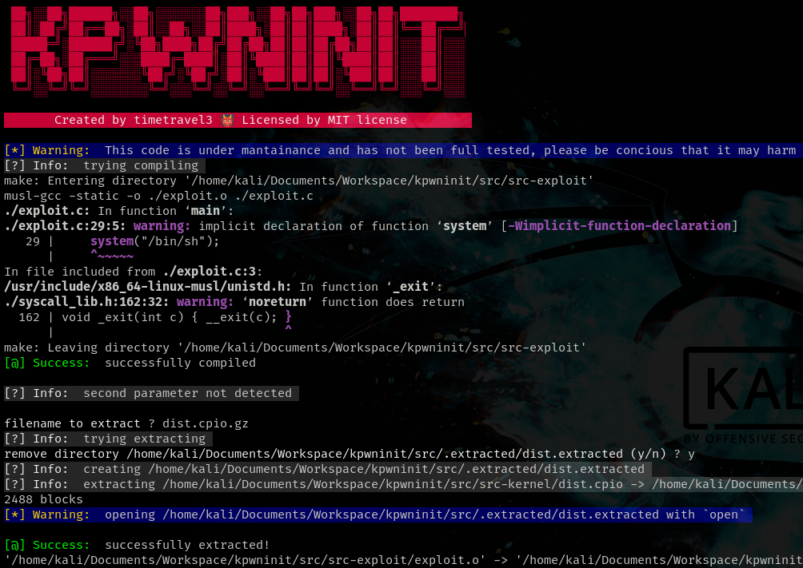

# KINI Kernel PWN Toolkit :dragon:
this program is a con venient tool for writing kernel exploits and manage your kernel filesystem, images. It also has a few key features that may improve your kernel exploit experience. 


## Usage

`./kini.sh [action ...]`

## Help
__Argument and filename, can be passed via argument line, or via stdin__


## Actions

* `init` -> Creates a simple directory tree. It can be modified in the script
* `exploit` -> This command is just a macro that executes a series of actions, these actions are `make` `extract` `compress` `run`

* `run` -> Just executes `$KERNELD/run.sh`, there should be a script that when run it emulates the kernel. Note your script should use `$KERNELD` to refer to the directory of the kernel and initrd, or instead use an absolute path

* `extract` -> Extracts an archive within `$KERNELD` into the `$EXTRACTED` directory, then it opens (by default) the extracted archive with `$EDITOR` which is `nvim` by default

* `compress` -> Compress a previously extracted directory back into `$KERNELD`

* `backup` -> Backups the initramfs of the kernel. You can find it in the 

* `restore` -> Copies back a file from `$BACKUPD` into the `$KERNELD` directory

<br>
__Default environment variables values:__
<br>


```sh
# Editor
EDITOR=vim

# Directories
BACKUPD="$MYPATH/.backups"
KERNELD="$MYPATH/kernel"
EXTRACTD="$MYPATH/fs"
EXPLOITD="$MYPATH/exploit"
WORKINGD="$MYPATH/.working"
```

> **NOTE**: do not remove `$MYPATH` from these values if you ar not using an absolute path


## License
This project is licensed under the terms of the MIT license

## Todo
- [ ] improve autocompletition 
- [ ] improve debugging
- [ ] add installation & uninstallation sections
